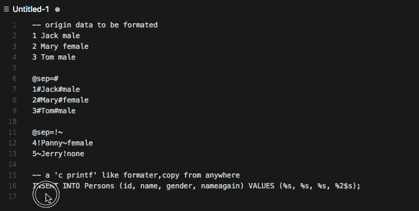

# Clipboard Format(pzformat) README

A clipboard format utility base on the [sprintf.js](https://github.com/alexei/sprintf.js).
(Migrate from my sublime plugin [pzformat](https://github.com/pandazki/pzformat))

## Features

* screen record from sublime+pzformat.


## Usage
### 1. Copy or cut your format string.(Just put it into your clipboard)
eg.
```
INSERT INTO Persons (id, name, gender) VALUES (%s, %s, %s);
```

### 2. Select all data which you want to format.
eg.
```
1 Jack male
2 Mary female
3 Tom male
```

### 3. Press [<code>cmd+shift+o</code>,<code>cmd+shift+f</code>]
All done.

### more
The default separator is `/[,，;\s]/`, you can specify it by using `@sep=your_separators`.

eg.
```
@sep=#
1#Jack#male
2#Mary#female
3#Tom#male
@sep=!~
4!Panny~female
5~Jerry!none
```

> Notice: if you set `editor.insertSpaces = true` in your settings, `\t` separator must be lose efficacy.

## Release Notes

### 1.0.0

Initial release of core format function.
